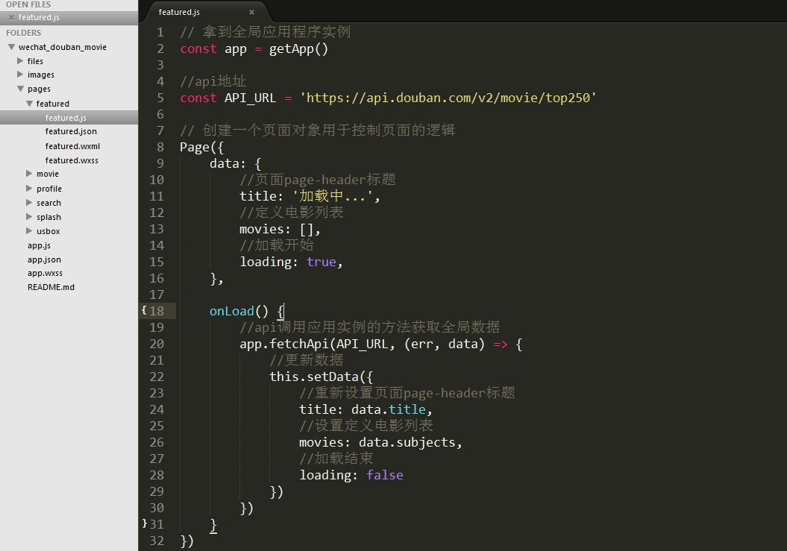
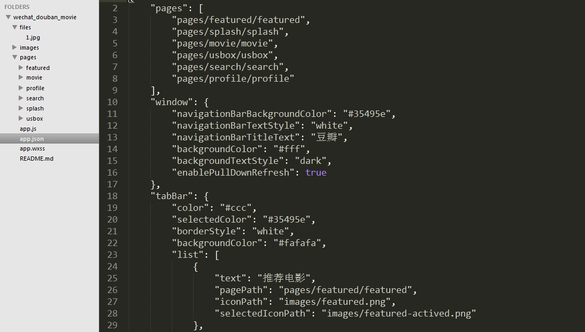
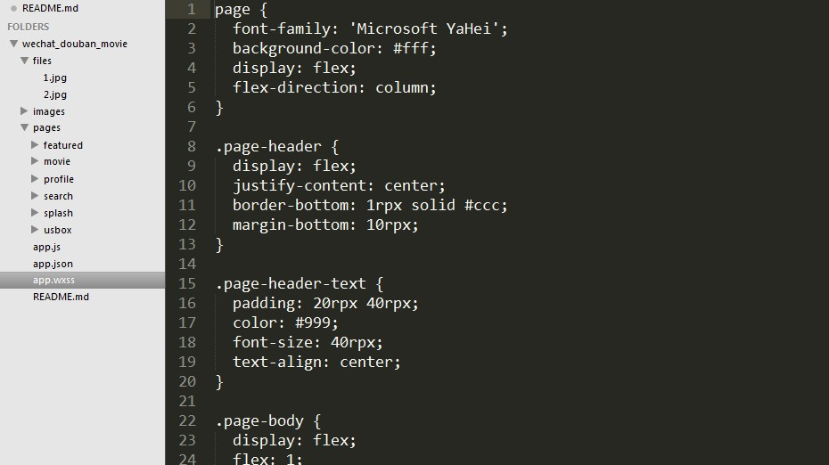

## 微信小程序-豆瓣电影-测试案例

#### 1、app.js 封装请求方式函数 fetchApi



#### 2、app.json 配置文件(配置页面样式、多少页面、菜单按钮)


#### 3、app.wxss 全局样式文件（定义页面的全局样式）


##### 参考项目：
[豆瓣电影](https://github.com/zce/weapp-demo/tree/backup "豆瓣电影")

##### 官方文档：
[官方文档](https://mp.weixin.qq.com/debug/wxadoc/dev/ "官方文档")

```
代码中已有大量的注释
```